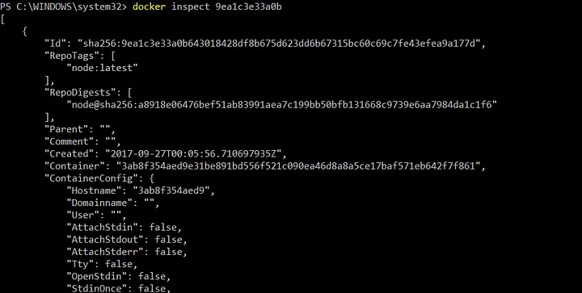

# Aula Docker

### Comandos básicos de Docker

Comando que vai nos listar informações do nosso docker
`docker info`

Comando que vai nos listar as versões do docker
`docker version`

Comando que vai nos listar as imagens que temos no nosso docker
`docker images`

Comando que vai rodar uma imagem
`docker run hello-world`

Comando para verificar o status do container
`docker ps`

Comando para verificar o status do container e também os containers que já foram parados
`docker ps -a`

Para que possamos ter informações sobre um contêiner nos executamos o comando
`docker stats (id ou apelido do container)`

onde temos:

- CONTAINER — ID do Container;
- CPU % — uso de CPU em porcentagem;
- MEM USAGE / LIMIT — Memória usada/Limite que você pode ter setado;
- MEM — uso de memória em porcentagem;
- NET I/O — I/O de Internet;
- BLOCK IO — Outros processos de I/O;

Caso você precise de mais detalhes sobre a sua imagem ou o seu contêiner, podemos utilizar o comando inspect.

`docker inspect (id ou apelido do container)`

Ele irá retornar um json com todas as informações relacionadas a nossa busca. No exemplo a baixo nós estamos executando ele na nossa imagem node.

Caso você tenha baixado uma imagem errada ou queira deletar alguma por um outro motivo, basta executar o comando a cima que ele deleta ela do seu host.

`docker rmi (nome da imagem)`

Com o exec nós podemos executar qualquer comando nos nossos contêineres sem precisarmos estar na console deles.

`docker exec (id_container ou nome_container)`

Vejamos a baixo alguns dos parâmetros que podemos utilizar com ele:

- -i permite interagir com o container
- -t associa o seu terminal ao terminal do container
- -it é apenas uma forma reduzida de escrever -i -t
- --name algum-nome permite atribuir um nome ao container em execução
- -p 8080:80 mapeia a porta 80 do container para a porta 8080 do host

- -d executa o container em background
- -v /pasta/host:/pasta/container cria um volume '/pasta/container' dentro do container com o conteúdo da pasta '/pasta/host' do host

Serve para iniciar um container
`docker start (id do container)`

Serve para parar um container
`docker stop (id do container)`
